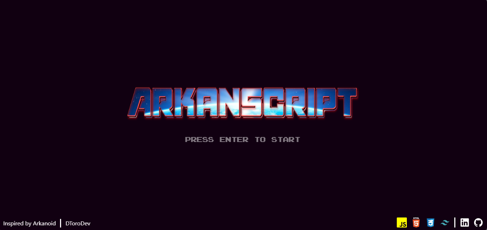
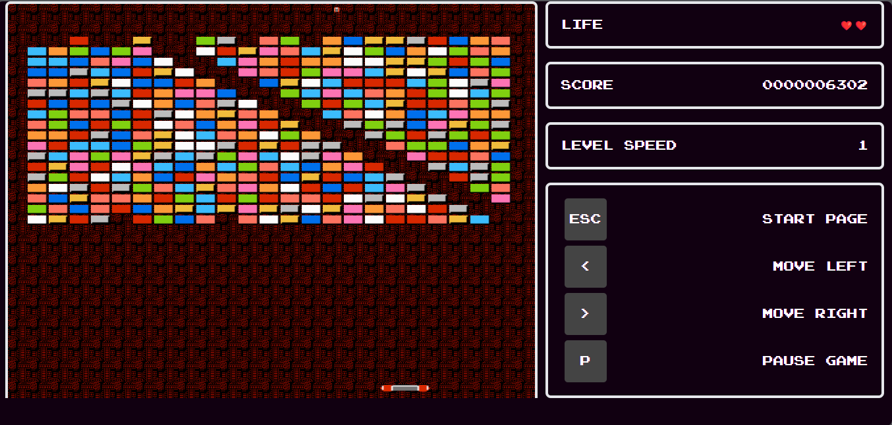
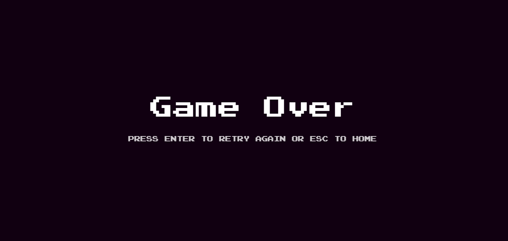

    
  <h3>
    <strong>ArkanScript inspired by Arkanoid and guided by midudev</strong>
  </h3>

    
  <h3>
    <strong>ArkanScript - Playing</strong>
  </h3>

    
  <h3>
    <strong>ArkanScript - Game Over</strong>
  </h3>

