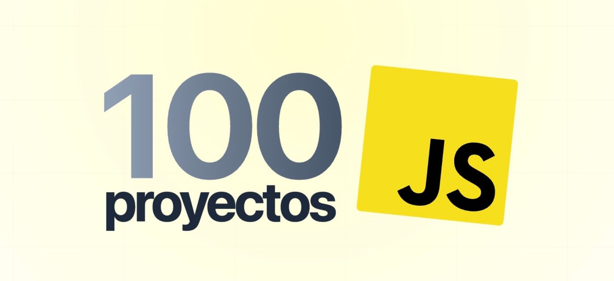

<div align="center">
    <a href="https://www.javascript100.dev">
     
    </a>
  <h3>
    <strong>Curso Midudev - 100 proyectos de JavaScript</strong>
  </h3>
</div>


<div align="center">


</div>

## ✨ Proyectos

|  #   | Proyecto         | Descripción                                                              | Código                                                                                                                                                                                   | Website                                                       |
| --- | ---------------- | ------------------------------------------------------------------------ | ---------------------------------------------------------------------------------------------------------------------------------------------------------------------------------------- | ------------------------------------------------------------- |
| 1   | **tinder-swipe** | Aprende a crear el efecto de swipe de Tinder con HTML, CSS y JavaScript. | [](https://github.com/midudev/javascript-100-proyectos/tree/main/01-tinder-swipe) | [](https://www.javascript100.dev/01-tinder-swipe) |
| 2   | **arkanoid-clone** | Juego mítico y clásico de Arkanoid para controlar con teclado. | [](https://github.com/midudev/javascript-100-proyectos/tree/main/02-arkanoid-game) | [](https://www.javascript100.dev/02-arkanoid-game) |

## 🚀 Contribuir

### **Introducción**

1. Para contribuir, crea un [Fork](https://github.com/dtoro-dev/js-100/fork) del proyecto.

2. Clona el repositorio en tu máquina local:

```bash
git clone git@github.com:tu_username/js-100.git
```

### **Proyectos**

1. Accede a la carpeta del proyecto que quieras:

```bash
cd 01-tinder-swipe
```

2. Instala la extensión [**Live Preview**](https://marketplace.visualstudio.com/items?itemName=ms-vscode.live-server) en Visual Studio Code.

3. Presiona `F1` y selecciona `Live Preview: Start Server`.

Realiza los cambios y crea una pull request 🚀.

### **Sitio web**

- Para contribuir al sitio web es necesario tener [Node.js +18](https://nodejs.org/) instalado y [pnpm](https://pnpm.io/):

```bash
npm install -g pnpm
```

1. Instala las dependencias:

```bash
cd web
pnpm install
```

2. Inicia el servidor de desarrollo:

```bash
pnpm dev
```

Realiza los cambios y crea una pull request 🚀.

## 🛠️ Stack

**Proyectos**:

- HTML, CSS & Javascript.

**Website**:

- [**Astro**](https://astro.build/) - The web framework for content-driven websites.
- [**Typescript**](https://www.typescriptlang.org/) - JavaScript with syntax for types.
- [**Tailwind CSS**](https://tailwindcss.com/) - A utility-first CSS framework for rapidly building custom designs.

## 👑 Contribuidores

<a href="https://github.com/dtoro-dev/js-100/graphs/contributors">
  
</a>